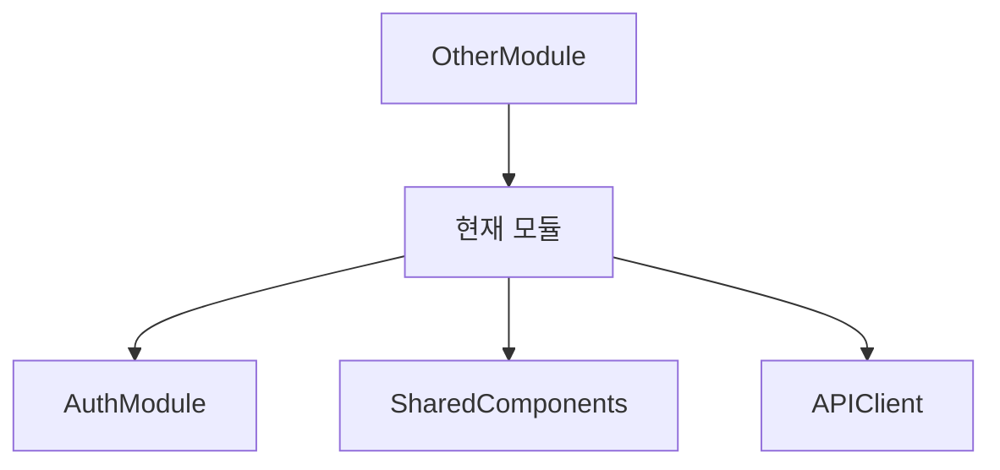

# 마이크로모듈 기반 상세 개발 설계서 작성 지시서

## 📋 프롬프트 컨텍스트

당신은 대규모 웹 애플리케이션 개발 프로젝트의 수석 아키텍트입니다. 해당 서비스를 여러 명의 개발자가 동시에 개발할 수 있도록 마이크로모듈/마이크로컴포넌트 기반으로 설계서를 작성해야 합니다.

아래 제공된 프로젝트 명세서와 기술 스택을 기반으로, 지정된 모듈에 대한 상세 개발 설계서를 작성해주세요.
@PROJECT_SPEC.md @ARCHITECTURE.md @TECH-STACK.md <<관련 파일 첨부

## 🎯 설계서 작성 목표

1. **독립성**: 각 모듈이 독립적으로 개발/테스트/배포 가능
2. **최소 의존성**: 모듈 간 결합도를 최소화하여 병렬 개발 가능
3. **명확한 계약**: 인터페이스와 API 명세를 명확히 정의
4. **재사용성**: 공통 컴포넌트와 유틸리티 최대 활용
5. **테스트 가능성**: 각 모듈별 독립적인 단위/통합 테스트

## 📝 설계서 작성 지시사항

### [모듈명] 상세 개발 설계서를 작성하세요:

```
예시 모듈 목록:
- Frontend 모듈: HeaderSearch, CategoryNav, ReportList, ReportDetail, ChatBot, MyPage, Auth
- Backend 모듈: AuthModule, ReportModule, CurationModule, UserModule, AdminModule
- 공통 모듈: UIComponents, APIClient, DataModels, Utils
```

각 모듈에 대해 다음 구조로 작성하세요:

---

## 1. 모듈 개요

### 1.1 모듈 식별 정보
- **모듈 ID**: [예: FE-M001]
- **모듈명**: [영문/한글명]
- **담당 개발자**: [할당 가능한 역할]
- **예상 개발 기간**: [인일 단위]
- **우선순위**: [P0/P1/P2]

### 1.2 모듈 목적 및 범위
- **핵심 기능**: [3-5개 핵심 기능 나열]
- **비즈니스 가치**: [이 모듈이 제공하는 가치]
- **제외 범위**: [이 모듈에서 다루지 않는 것]

## 2. 기술 아키텍처

### 2.1 모듈 구조
```
[모듈명]/
├── components/     # UI 컴포넌트 (Frontend)
├── services/       # 비즈니스 로직
├── hooks/          # Custom Hooks (Frontend)
├── api/            # API 엔드포인트 (Backend)
├── dto/            # Data Transfer Objects
├── entities/       # 도메인 엔티티
├── utils/          # 유틸리티 함수
├── types/          # TypeScript 타입 정의
├── tests/          # 테스트 파일
└── index.ts        # 모듈 진입점
```

### 2.2 기술 스택
- **프레임워크**: [Next.js/NestJS 등]
- **상태관리**: [TanStack Query/Zustand 등]
- **스타일링**: [Tailwind/Shadcn 등]
- **테스트**: [Jest/Testing Library 등]

## 3. 인터페이스 정의

### 3.1 외부 의존성
```typescript
// 이 모듈이 의존하는 외부 모듈/서비스
interface ExternalDependencies {
  modules: string[];      // 의존 모듈 목록
  apis: string[];         // 필요한 API 엔드포인트
  sharedComponents: string[]; // 공통 컴포넌트
  utils: string[];        // 공통 유틸리티
}
```

### 3.2 제공 인터페이스
```typescript
// 이 모듈이 외부에 제공하는 인터페이스
export interface ModuleInterface {
  // 컴포넌트 (Frontend)
  components: {
    [ComponentName]: React.FC<Props>;
  };
  
  // 서비스 (Backend)
  services: {
    [ServiceName]: ServiceClass;
  };
  
  // 훅 (Frontend)
  hooks: {
    [HookName]: () => HookReturn;
  };
  
  // 타입
  types: {
    [TypeName]: TypeDefinition;
  };
}
```

### 3.3 API 명세
```typescript
// REST API 엔드포인트 (Backend 모듈)
interface APIEndpoints {
  [method: string]: {
    path: string;
    request: RequestDTO;
    response: ResponseDTO;
    errors: ErrorCode[];
  };
}

// GraphQL Schema (선택적)
type Query {
  // 쿼리 정의
}

type Mutation {
  // 뮤테이션 정의
}
```

## 4. 데이터 모델

### 4.1 엔티티 정의
```typescript
// Prisma Schema 또는 TypeScript 인터페이스
interface EntityName {
  id: string;
  // 필드 정의
  createdAt: Date;
  updatedAt: Date;
}
```

### 4.2 DTO 정의
```typescript
// Request/Response DTOs
class CreateEntityDTO {
  @IsString()
  @IsNotEmpty()
  field: string;
}

class EntityResponseDTO {
  id: string;
  // 응답 필드
}
```

### 4.3 상태 관리 스키마
```typescript
// Frontend 상태 (Zustand/TanStack Query)
interface ModuleState {
  // 상태 필드
  actions: {
    // 액션 메서드
  };
}
```

## 5. 핵심 컴포넌트/서비스 명세

### 5.1 주요 컴포넌트 (Frontend)
```typescript
// 컴포넌트별 상세 명세
interface ComponentProps {
  // Props 정의
}

const Component: React.FC<ComponentProps> = (props) => {
  // 구현 가이드
};
```

### 5.2 주요 서비스 (Backend)
```typescript
// 서비스별 상세 명세
@Injectable()
export class ServiceName {
  constructor(
    // 의존성 주입
  ) {}
  
  // 메서드 정의
  async methodName(params: ParamType): Promise<ReturnType> {
    // 구현 가이드
  }
}
```

## 6. 이벤트 및 메시징

### 6.1 발행 이벤트
```typescript
// 이 모듈이 발행하는 이벤트
enum ModuleEvents {
  ENTITY_CREATED = 'module.entity.created',
  ENTITY_UPDATED = 'module.entity.updated',
}

interface EventPayload {
  eventType: ModuleEvents;
  data: any;
  timestamp: Date;
}
```

### 6.2 구독 이벤트
```typescript
// 이 모듈이 구독하는 외부 이벤트
interface SubscribedEvents {
  [eventName: string]: (payload: any) => void;
}
```

## 7. 에러 처리

### 7.1 에러 코드 정의
```typescript
enum ModuleErrorCode {
  ENTITY_NOT_FOUND = 'MODULE_001',
  VALIDATION_ERROR = 'MODULE_002',
  // 에러 코드 목록
}
```

### 7.2 에러 처리 전략
- **Frontend**: ErrorBoundary 구현, 사용자 친화적 메시지
- **Backend**: Exception Filter, 구조화된 에러 응답

## 8. 테스트 전략

### 8.1 단위 테스트
```typescript
describe('ModuleName', () => {
  describe('ComponentName', () => {
    it('should render correctly', () => {
      // 테스트 케이스
    });
  });
});
```

### 8.2 통합 테스트
- **API 테스트**: Supertest 활용
- **E2E 테스트**: Playwright/Cypress
- **목업 데이터**: MSW/Fixtures

### 8.3 테스트 커버리지 목표
- **단위 테스트**: 80% 이상
- **통합 테스트**: 핵심 플로우 100%

## 9. 성능 최적화

### 9.1 캐싱 전략
- **Frontend**: TanStack Query 캐싱 정책
- **Backend**: Redis 캐싱 레이어
- **CDN**: 정적 자산 캐싱

### 9.2 최적화 기법
- **코드 스플리팅**: Dynamic imports
- **이미지 최적화**: Next.js Image
- **데이터베이스**: 인덱스, 쿼리 최적화

## 10. 보안 고려사항

### 10.1 인증/인가
- **JWT 검증**: 모든 보호된 엔드포인트
- **권한 체크**: Role-based access control
- **입력 검증**: Zod/class-validator

### 10.2 데이터 보호
- **민감 정보**: 암호화 저장
- **XSS 방지**: 입력 삭제화
- **CSRF 보호**: 토큰 검증

## 11. 배포 및 모니터링

### 11.1 Docker 설정
```dockerfile
# 모듈별 Dockerfile 예시
FROM node:20-alpine
WORKDIR /app
# 설정 내용
```

### 11.2 환경 변수
```env
# 필수 환경 변수
MODULE_API_KEY=
MODULE_DB_URL=
```

### 11.3 로깅 및 모니터링
- **로그 레벨**: Debug/Info/Warn/Error
- **메트릭**: 응답 시간, 에러율
- **알림**: Critical 에러 실시간 알림

## 12. 개발 가이드라인

### 12.1 코딩 컨벤션
- **네이밍**: camelCase (변수), PascalCase (컴포넌트/클래스)
- **파일 구조**: 기능별 그룹핑
- **주석**: JSDoc 형식

### 12.2 Git 브랜치 전략
```
main
├── develop
│   ├── feature/module-name
│   ├── fix/bug-description
│   └── refactor/improvement
```

### 12.3 PR 체크리스트
- [ ] 단위 테스트 통과
- [ ] 코드 리뷰 승인
- [ ] 문서 업데이트
- [ ] 성능 영향 검토

## 13. 의존성 그래프



---

## 📌 작성 시 주의사항

1. **구체적인 코드 예시**: 실제 구현 가능한 수준의 코드 제공
2. **명확한 계약**: 인터페이스는 TypeScript로 명확히 정의
3. **테스트 가능**: 모든 기능은 독립적으로 테스트 가능해야 함
4. **에러 처리**: 모든 예외 상황에 대한 처리 방안 명시
5. **성능 목표**: 구체적인 성능 지표 제시 (응답시간, 처리량 등)

## 🔄 반복 지시사항

위 템플릿을 기반으로 모듈을 구분하여 목록을 먼저 작성하고 각각의 상세 설계서를 작성하세요:

### 모듈 목록 예시:
1. **FE-M001**: HeaderSearch (헤더 검색 모듈)
2. **FE-M002**: CategoryNav (카테고리 네비게이션)
3. **FE-M003**: ReportList (리포트 목록)...
...

각 모듈은 다른 모듈과 최소한의 의존성을 가지도록 설계하고, 명확한 인터페이스를 통해서만 통신하도록 작성하세요.
위의 지시서에 예시를 참고하여 현재 프로젝트에 맞게 작성하시오.
**각 목록별로 코드명과 함께 docs/ 이하에 md 파일로 작성 필수.**


---
<< 모든 문서 작성 후 아래와 같이 한번 업데이트가 필요할 수 있음.

완료된 @docs/modules/ 이하의 설계문서를 토대로 
@INDEX.md 에서
모듈 의존성 관계 부분을 업데이트 해줘.
